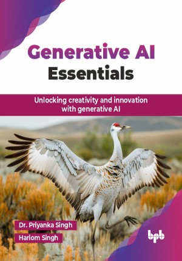

# Generative AI Essentials

Unlocking creativity and innovation with generative AI.

This is the repository for [Generative AI Essentials
](https://bpbonline.com/products/generative-ai-essentials?variant=44336952606920),published by BPB Publications.

## About the Book
Generative AI is changing the way we think about creativity and problem-solving. This book is your go-to guide for understanding and working with this exciting technology. 

This book offers a clear introduction to generative AI, starting with basics like machine learning and deep learning. It explains key models, including GANs and VAEs, breaking down their architectures and training methods. You will discover how Transformer models like GPT have transformed natural language processing and enabled advancements in language generation. The book explores practical applications such as image synthesis, style transfer, and text generation, showing how generative AI merges technology with creativity. Advanced topics like reinforcement learning, AI ethics, and bias are also covered. Practical tips for creating your own generative AI models, along with insights into the future of this groundbreaking field, making it an essential resource for AI enthusiasts and professionals.

By the end of this book, you will have a firm grasp of generative AI concepts and practical skills to get you started. You will be well-prepared to use cloud platforms like AWS, Azure, and GCP to build and launch powerful generative AI projects. From creating realistic images to crafting natural text, you will explore hands-on examples while tackling important ethical questions. This book gives you the skills and confidence to explore the limitless potential of generative AI.

## What You Will Learn
• Build foundational knowledge of generative AI principles and models.

• Apply machine learning and deep learning for creative content generation.

• Leverage GANs, VAEs, and Transformer models in real-world scenarios.

• Master cloud tools for scalable generative AI development.

• Address ethical challenges and implement responsible AI practices.

• Explore advanced applications and future directions of generative AI.
